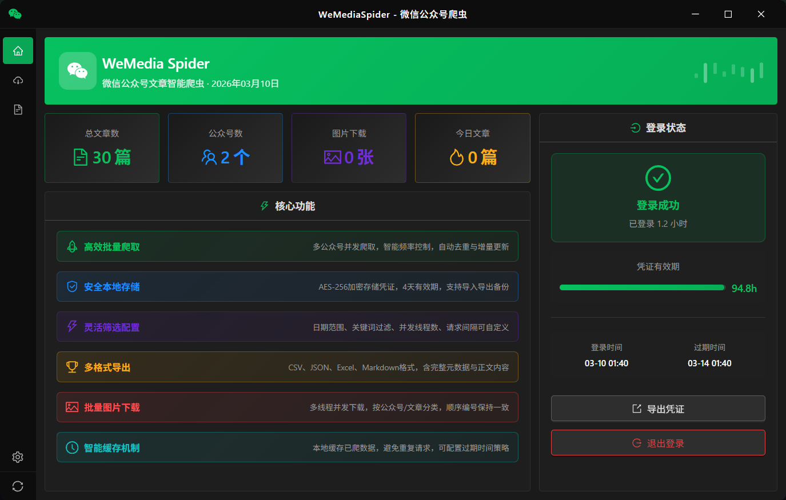

# WeMediaSpider-Go

微信公众号文章智能爬虫 - 支持批量爬取、多格式导出、数据库存储、专业级安全架构

[](https://github.com/vag-Zhao/WeMediaSpider-Go/releases)
[](LICENSE)
[](https://golang.org/)
[](https://wails.io/)

## 📸 应用截图



## ✨ v1.2.0 重大更新

- 🗄️ **数据库迁移**: JSON → SQLite，性能大幅提升
- 🔐 **专业级安全**: AES-256-GCM + HMAC 完整性校验
- 📊 **按公众号分组**: 数据按公众号分组显示
- 🎨 **UI 全面优化**: 优化布局、滚动体验、固定标题

## 🚀 核心功能

- **批量爬取**: 多公众号并发爬取，实时进度显示
- **多格式导出**: Excel、CSV、JSON、Markdown
- **图片下载**: 批量下载文章图片
- **数据库存储**: SQLite + GORM，高效查询
- **安全加密**: AES-256-GCM + HMAC 完整性校验
- **智能缓存**: 避免重复请求
- **自动更新**: 检查新版本并提醒
- **系统托盘**: 最小化到托盘，后台运行

## 📦 快速开始

### 下载使用（推荐）

1. 访问 [Releases 页面](https://github.com/vag-Zhao/WeMediaSpider-Go/releases)
2. 下载 `WeMediaSpider-v1.2.0-windows-amd64-with-exe.tar.gz`
3. 解压后运行 `WeMediaSpider.exe`

### 从旧版本升级

**重要**: v1.2.0 包含数据格式变更，需要迁移。

```bash
# 1. 备份数据（推荐）
cp -r ~/.wemediaspider ~/.wemediaspider.backup

# 2. 运行迁移工具
go run backend/cmd/migrate/main.go

# 3. 启动应用
```

## 🛠️ 开发

### 环境要求

- Go 1.18+
- Node.js 16+
- Wails CLI

### 开发模式

```bash
# 克隆项目
git clone https://github.com/vag-Zhao/WeMediaSpider-Go.git
cd WeMediaSpider-Go

# 运行开发模式
wails dev
```

### 构建应用

```bash
wails build
```

## 📖 使用说明

1. **登录**: 扫码登录微信公众号平台
2. **搜索账号**: 输入公众号名称搜索
3. **配置爬取**: 设置日期范围、并发数
4. **开始爬取**: 实时查看进度
5. **查看结果**: 按公众号分组查看文章
6. **导出数据**: 支持多种格式导出

## 🗄️ 数据库架构

- **accounts** - 公众号表
- **articles** - 文章表（外键关联 accounts）
- **app_stats** - 应用统计表

数据库位置: `~/.wemediaspider/wemedia.db`

## 🔒 安全特性

- **AES-256-GCM** 加密存储
- **HMAC-SHA256** 完整性校验
- **0600** 文件权限保护
- **PBKDF2** 密钥派生（100,000 次迭代）

详见 [SECURITY.md](SECURITY.md)

## 📝 技术栈

**后端**: Go + Wails v2 + SQLite + GORM
**前端**: React + TypeScript + Ant Design + Vite
**安全**: AES-256-GCM + HMAC-SHA256 + PBKDF2

## 📋 项目结构

```
WeMediaSpider/
├── backend/              # Go 后端
│   ├── app/             # 应用逻辑
│   ├── cmd/migrate/     # 数据迁移工具
│   ├── internal/        # 内部包
│   │   ├── database/    # 数据库模块
│   │   ├── repository/  # 数据访问层
│   │   └── spider/      # 爬虫核心
│   └── pkg/             # 公共包
├── frontend/            # React 前端
│   └── src/
│       ├── pages/       # 页面
│       └── components/  # 组件
└── wails.json          # Wails 配置
```

## 📄 许可证

MIT License - 详见 [LICENSE](LICENSE)

## 🙏 致谢

感谢所有用户的支持！

## 📞 反馈

- [Issues](https://github.com/vag-Zhao/WeMediaSpider-Go/issues)
- [Releases](https://github.com/vag-Zhao/WeMediaSpider-Go/releases)
- [Changelog](CHANGELOG.md)
